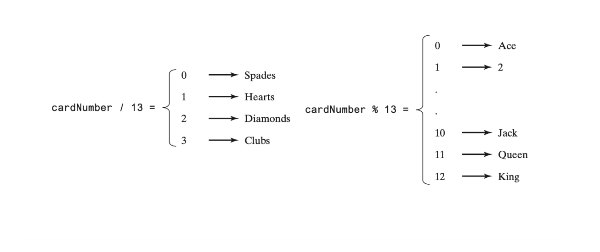

# Deck of Cards

---

You are designing a card game where players draw four random cards from a
standard deck of 52 cards.

Cards can be represented using an array named `deck`, filled with initial
values 0-51.

Each card has a suit (Spades, Hearts, Diamonds, Clubs) and a rank (Ace, 2-10,
Jack, Queen, King).

Card numbers 0-12, 13-25, 26-38, and 39-51 represent 13 spades, 13 hearts,
13 diamonds, and 13 clubs, respectively (figure 1).

- `cardNumber/13` determines the suit of the card, and
- `cardNumber%13` determines the rank of the card (figure 2). After shuffling
  the array deck, pick the first four cards from the deck.

The program must display the cards from these four card numbers.

Figure 1

Figure 2

